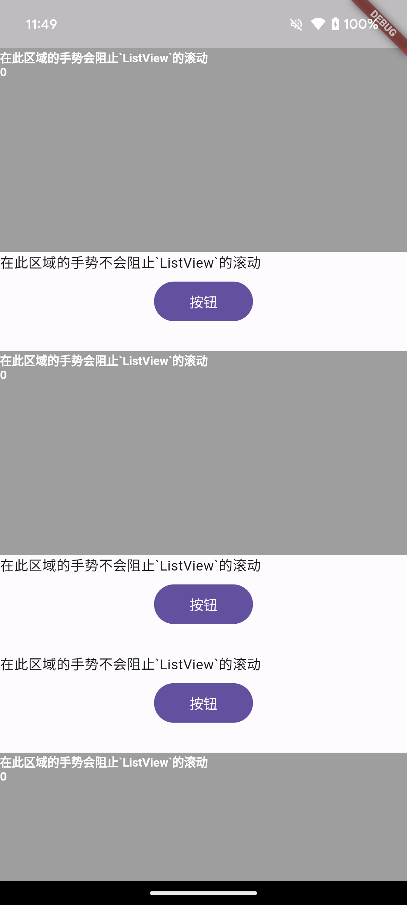

[](https://pub.dev/packages/flutter_gesture_hit_intercept)

# flutter_gesture_hit_intercept

Flutter 实现命中拦截, 用于解决手势冲突, 阻止其它小部件获取手势事件

使用场景: 比如在`ListView`中, 有一个`tile`想要获取手势事件, 同时又想要`ListView`阻止滚动,
这时候就可以使用这个库.



## 安装

安装最新版本. [](https://pub.dev/packages/flutter_gesture_hit_intercept/install).

## 快速开始

导入对应的包, 使用 `GestureHitInterceptScope` 小部件包裹 `ListView`, 然后在需要拦截手势的`RenderBox`上使用 `GestureHitInterceptScope.of(context)?.interceptHitBox = this` 方法即可.

```dart
@override
Widget build(BuildContext context) {
  return MaterialApp(
    home: Scaffold(
      body: GestureHitInterceptScope(
        child: ListView(
          physics: const AlwaysScrollableScrollPhysics(
            parent: BouncingScrollPhysics(),
          ),
          children: [
            const GestureTestWidget(), //测试小部件
            buildItem(context),
            ...
          ],
        ),
      ),
    ),
  );
}
```

## [license](https://raw.githubusercontent.com/angcyo/flutter_gesture_hit_intercept/master/LICENSE)

MIT License

Copyright (c) 2024 angcyo